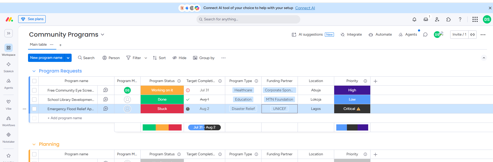

# Custom Columns

## Overview

To support real-world NGO program management, the default Monday.com board was extended with custom columns tailored to Mudandy Foundation's operational workflow.

These fields capture essential information required for planning, executing, monitoring, and reporting community programs.

---

## Custom Columns Implemented

### Program Manager

Assigns responsibility for each program and provides accountability throughout the project lifecycle.

### Program Status

Tracks the current progress of each initiative.

Configured statuses include:

- New Request
- Planning
- In Progress
- Monitoring
- On Hold
- At Risk
- Completed

This status column powers multiple board views, dashboards, and executive reports.

### Target Completion

Stores the expected completion date for every program.

This enables:

- Calendar View
- Gantt View
- Timeline planning
- Deadline monitoring

### Program Type

Categorizes programs by intervention area.

Examples include:

- Healthcare
- Education
- Disaster Relief
- Women Empowerment
- Youth Development
- Water & Sanitation
- Livelihood Support

Categorization enables filtering, reporting, and dashboard analytics.

### Funding Partner

Identifies the organization funding each initiative.

Example values include:

- WHO
- UNICEF
- MTN Foundation
- Corporate Sponsor
- Internal Funding

Tracking funding partners improves financial reporting and donor visibility.

### Location

Captures the geographical area where each program is delivered.

Example locations include:

- Abuja
- Lagos
- Kaduna
- Enugu
- Port Harcourt
- Lokoja
- Ibadan

Location data supports regional reporting and impact analysis.

### Priority

Indicates the urgency or strategic importance of each initiative.

Configured priorities include:

- Low
- Medium
- High
- Critical

Priority levels help leadership allocate resources effectively and respond to urgent community needs.

---

## Business Value

The custom columns transform a generic task board into a structured NGO Program Management System capable of supporting planning, implementation, monitoring, donor reporting, and executive decision-making.

---

## Screenshot

**Configured Custom Columns**

---

## Consultant Notes

The custom columns were intentionally designed around NGO operational requirements rather than Monday.com's default task management fields. This provides richer reporting capabilities while supporting future dashboard creation, filtering, and portfolio-level analytics.
