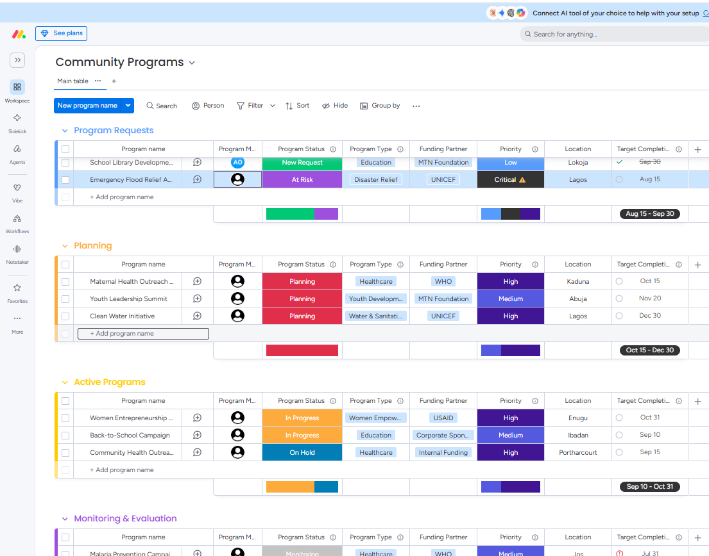
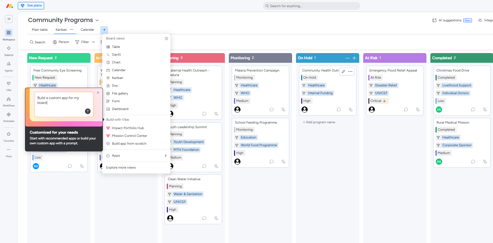
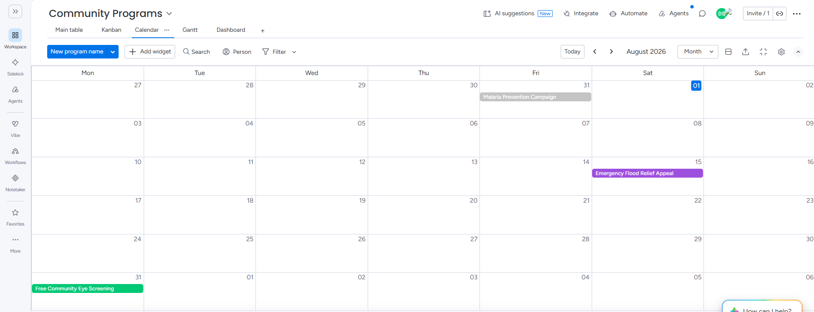
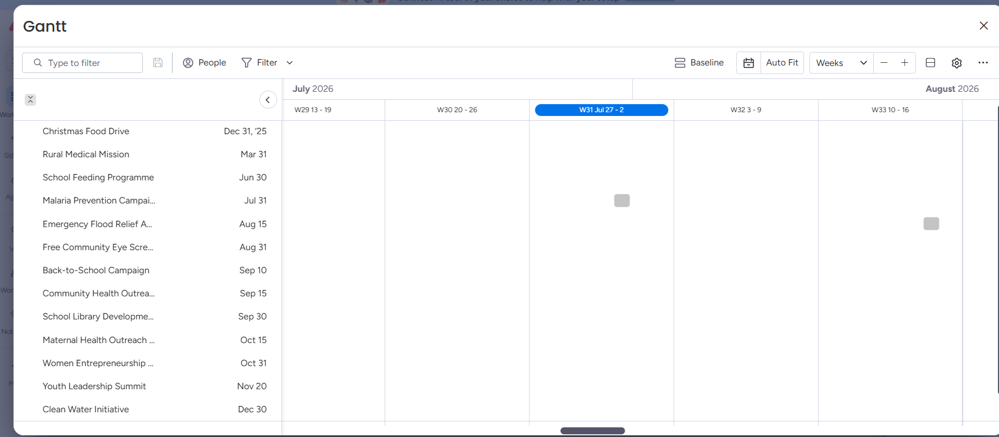
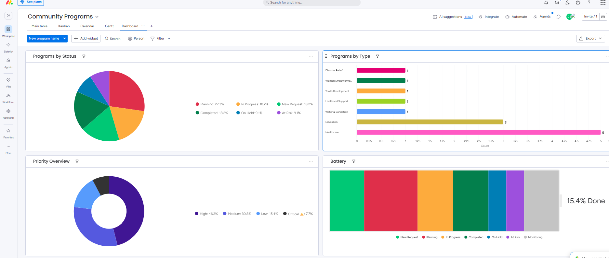

# Board Views

## Overview

To improve collaboration and provide different perspectives for stakeholders, multiple board views were configured for the Community Programs board.

Each view serves a unique operational purpose while displaying the same underlying program data.

---

## Main Table

The Main Table serves as the primary workspace for creating, editing, and managing community programs.

Team members can quickly update:

- Program details
- Assigned managers
- Status
- Priority
- Funding partners
- Locations
- Target completion dates

This view functions as the central source of truth for all program information.

---

## Kanban View

A Kanban board was configured using the **Program Status** column.

Programs automatically move through workflow stages including:

- New Request
- Planning
- In Progress
- Monitoring
- On Hold
- At Risk
- Completed

This visual workflow helps project teams monitor progress and quickly identify bottlenecks.

---

## Calendar View

A Calendar View was created using the **Target Completion** date.

This enables the organization to:

- View upcoming program deadlines
- Coordinate multiple initiatives
- Plan workloads across the month
- Prevent scheduling conflicts

---

## Gantt View

A Gantt View was configured to provide a timeline-based representation of all programs.

This view assists leadership by:

- Monitoring project schedules
- Reviewing completion timelines
- Comparing planned delivery dates
- Supporting long-term operational planning

---

## Dashboard View

An executive dashboard was created to summarize program performance using visual reports.

Dashboard widgets include:

- Programs by Status
- Programs by Type
- Priority Overview

These dashboards provide management with real-time insights for reporting and strategic decision-making.

---

## Business Value

Providing multiple views allows different stakeholders to interact with the same operational data in the format most relevant to their responsibilities.

Operational staff benefit from detailed task management, while leadership gains high-level visibility through dashboards and visual reports.

---

## Screenshots

### Main Table

### Kanban View

### Calendar View

### Gantt View

### Executive Dashboard

---

## Consultant Notes

Rather than relying on a single board layout, multiple synchronized views were configured to support operational teams, project managers, and executives. Each view presents the same underlying data in a format optimized for planning, execution, scheduling, or reporting.
