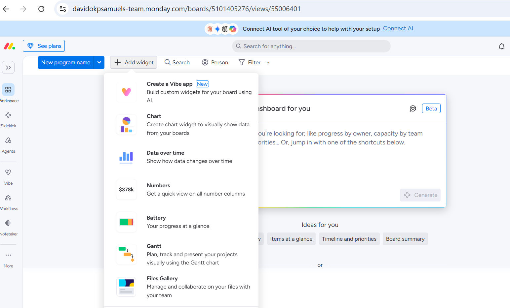
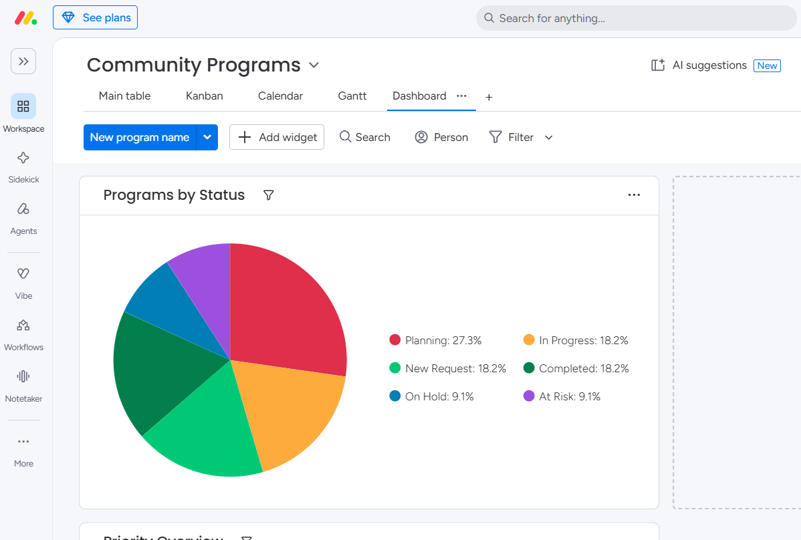
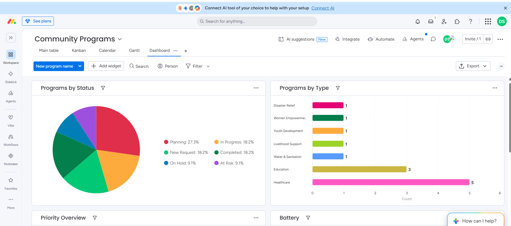

# Executive Dashboard

## Overview

An executive dashboard was designed to provide leadership with a real-time overview of community program performance.

Rather than reviewing individual program records, management can quickly monitor project health using visual reports and summary charts.

---

## Dashboard Design

The dashboard was built by selecting and configuring multiple reporting widgets based on the data captured within the Community Programs board.

Widgets were chosen to answer common operational questions such as:

- How many programs are currently active?
- Which initiatives require attention?
- Which program categories are most common?
- What is the overall priority distribution?

---

## Programs by Status

A pie chart was configured to visualize program distribution across each workflow stage.

Displayed statuses include:

- New Request
- Planning
- In Progress
- Monitoring
- On Hold
- At Risk
- Completed

This provides an immediate overview of operational progress.

---

## Programs by Type

A horizontal bar chart summarizes the number of programs by intervention area.

Examples include:

- Healthcare
- Education
- Disaster Relief
- Youth Development
- Women Empowerment
- Livelihood Support
- Water & Sanitation

This helps management understand organizational focus and resource allocation.

---

## Priority Overview

A doughnut chart summarizes program priorities, allowing leadership to identify urgent initiatives requiring additional oversight.

Priority levels include:

- High
- Medium
- Low
- Critical

---

## Business Value

The dashboard transforms operational data into actionable insights for leadership.

Instead of reviewing dozens of records manually, decision-makers can monitor organizational performance through concise visual reports that support planning, donor reporting, and strategic discussions.

---

## Screenshots

### Dashboard Widget Library

### Programs by Status Widget

### Programs by Type Widget

### Executive Dashboard

---

## Consultant Notes

The dashboard was intentionally designed for executive reporting rather than day-to-day task management. Each widget was selected to present key operational metrics in a format suitable for leadership meetings and stakeholder reporting.
